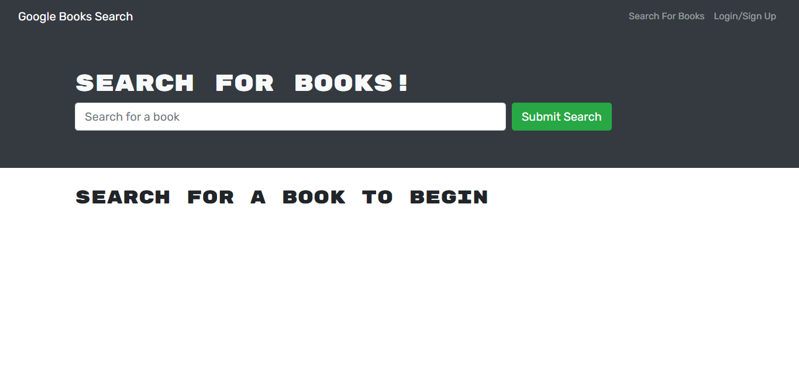
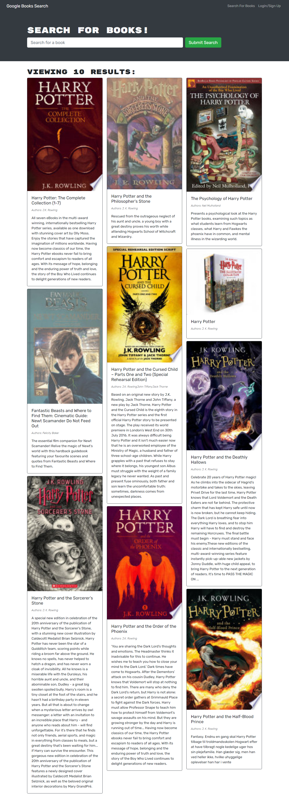
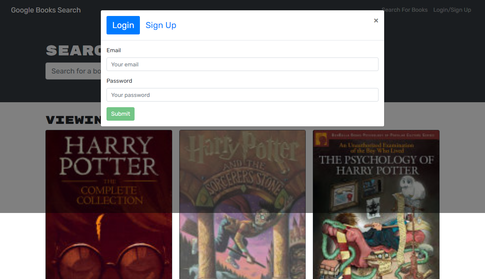

## MERN: Book Search Engine

<h2> Table of Contents </h2>

- [Project Link](#project-link)
- [Description](#description)
- [User story](#user-story)
- [What did we do](#what-did-we-do)
- [Getting Started](#getting-started)
- [Screenshots](#screenshots)

## Project Link

Click [here](https://stormy-beach-18418.herokuapp.com/) to view project on Heroku
Click [here](https://pdubb3.github.io/mern-book-search-engine/) to view GIT repo

## Description

In this project, we were given a starter code with a fully functioning Google Books API search engine built with a RESTful API. We had to refactor it to be a GraphQl API built with Apollo Server. The app was built using the MERN stack with a React front end, MongoDB database, and Node.js/Express.js server and API. The app allows users to save book search to the back end.

## User story

As an avid reader, I want to search for new books to read so that I can keep a list of books to purchase.
As a user, I will be able to do the following:

- [x] When I load the search engine, I am presented with a menu with the options Search for Books and Login/Signup.
- [x] When I click on the Search for Books menu option, I am presented with an input field to search for books and a submit button.
- [x] When I am not logged in and enter a search term in the input field and click the submit button, then I am presented with several search results, each featuring a book’s title, author, description, image, and a link to that book on the Google Books site
- [x] When I click on the Login/Signup menu option, then a modal appears on the screen with a toggle between the option to log in or sign up
- [x] When the toggle is set to Signup THEN I am presented with two inputs for an email address and a password and login button
- [x] When I enter a valid email address and create a password and click on the signup button
      THEN my user account is created and I am logged in to the site
- [x] When I enter my account’s email address and password and click on the login button
      THEN I the modal closes and I am logged in to the site
- [x] When I am logged in to the site
      THEN the menu options change to Search for Books, an option to see my saved books, and Logout
- [x] When I am logged in and enter a search term in the input field and click the submit button
      THEN I am presented with several search results, each featuring a book’s title, author, description, image, and a link to that book on the Google Books site and a button to save a book to my account
- [x] When I click on the Save button on a book
      THEN that book’s information is saved to my account
- [x] When I click on the option to see my saved books, then I am presented with all of the books I have saved to my account, each featuring the book’s title, author, description, image, and a link to that book on the Google Books site and a button to remove a book from my account
- [x] When I click on the Remove button on a book, then that book is deleted from my saved books list
- [x] When I click on the Logout button, I am logged out of the site and presented with a menu with the options Search for Books and Login/Signup and an input field to search for books and a submit button

## What did we do?

- [x] Set up an Apollo Server to use GraphQL queries and mutations to fetch and modify data, replacing the existing RESTful API.
- [x] Modify the existing authentication middleware so that it works in the context of a GraphQL API.
- [x] Create an Apollo Provider so that requests can communicate with an Apollo Server.
- [x] Deploy the application to Heroku with a MongoDB database using MongoDB Atlas.

## Getting started

- Create a new GitHub repository called mern-book-search-engine
- Clone github project onto your local machine
- Navigate into the project
- Open the project into VS code

```
git clone git@github.com:PDUBB3/mern-book-search-engine.git
cd weather-dashboard
code .
```

### Screenshot search engine



### Screenshot showing results when user searches "Harry Potter"



### Screenshot of login form



## Variables

```
{
  "addUserInput": {
    "username": "bobsmith",
    "email": "bobsmith@email.com",
    "password": "password123"
  },
  "loginInput": {
    "email": "bobsmith@email.com",
    "password": "password123"
  },
  "saveBookInput": {
    "bookId": "456",
    "authors": ["Alice Green"],
    "title": "Your Book",
    "description": "bad bad bad",
    "image": "foo bar",
    "link": "biz baz"
  },
  "removeBookBookId": "123"
}
```

## Query

### me

```
query Query {
  me {
    _id
    username
    email
    bookCount
    savedBooks {
      bookId
      authors
      description
      title
      image
      link
    }
  }
}
```

## Mutation

### addUser

```
mutation Mutation($addUserInput: AddUserInput!) {
  addUser(input: $addUserInput) {
    token
    user {
      _id
      username
      email
      bookCount
      savedBooks {
        bookId
        authors
        description
        title
        image
        link
      }
    }
  }
}
```

### login

```
mutation Mutation($loginInput: LoginInput!) {
  login(input: $loginInput) {
    token
    user {
      _id
      username
      email
      bookCount
      savedBooks {
        bookId
        authors
        description
        title
        image
        link
      }
    }
  }
}
```

### saveBook

```
mutation Mutation($saveBookInput: SaveBookInput!) {
  saveBook(input: $saveBookInput) {
    _id
    username
    email
    bookCount
    savedBooks {
      bookId
      authors
      description
      title
      image
      link
    }
  }
}
```

### removeBook

```
mutation Mutation($removeBookBookId: ID!) {
  removeBook(bookId: $removeBookBookId) {
    _id
    username
    email
    bookCount
    savedBooks {
      bookId
      authors
      description
      title
      image
      link
    }
  }
}
```
